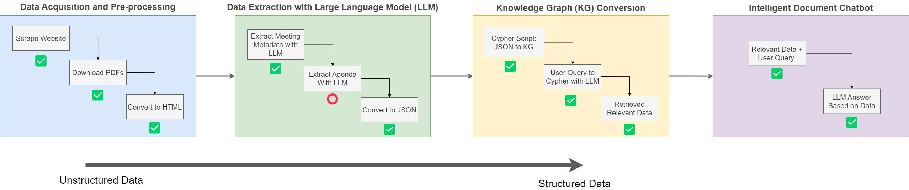

## Project Setup

To set up the project, follow the steps below:

1. Create a new conda environment by running the following command:

    ```bash
    conda create -n meeting-protocol-chatbot python=3.11
    
    conda activate meeting-protocol-chatbot
    ```

1. Clone the project repository by executing the following command:

    ```bash
    git clone https://github.com/NoviaIntSysGroup/meeting-protocol-chatbot.git
    ```

1. Navigate to the project directory and install the required packages by running the following command:

    ```bash
    pip install -e .
    ```

## Running the Project

To run the project, perform the following steps:

1. Navigate to the project directory.

1. Open the `notebooks/unstructured_to_structured_data_pipeline.ipynb` file.

1. Execute the notebook to run the project.


## Project Structure

The project directory contains the following files and folders:

- `notebooks/`: Contains the notebooks used in the project.
- `src/`: Contains the source code of the project.
- `data/`: Contains the data used in the project. PDFs and HTML files downloaded by the scripts are stored here.
- `data/example_prompts/`: Contains the prompts used for LLMs.
- `assets/`: Contains the images used in the project.

---

## Project Progress

### Data Processing Workflow



This figure outlines the workflow for converting unstructured data from meeting protocols into structured data suitable for creating a knowledge graph. The idea is to use a Large Language Model (LLM) to extract the necessary information from the meeting protocols, and then convert the extracted data into a knowledge graph so that data can be retrieved and queried quickly and reliably.

> Note: The workflow is currently incomplete, and the steps that have been implemented is marked with ✅

#### Data Acquisition and Pre-processing

1. ✅ **Scrape Website**: The initial step involves scraping the [website of city of nykerleby](https://kungorelse.nykarleby.fi:8443/ktwebbin/dbisa.dll/ktwebscr/pk_kokl_tweb.htm) to gather the required data.
1. ✅ **Download PDFs**: After scraping, we have metadata and download links for the protocols which is then downloaded for further processing.
1. ✅ **Convert to HTML**: The PDFs are converted into HTML format (instead of plain text). The html preserves the layout information of the PDFs, which is useful for extracting the data.

#### Data Extraction with Large Language Model (LLM)

> The structure of the meetings are as follows:

        

1. ✅ **Extract Meeting Metadata with LLM**: Utilize a Large Language Model to extract metadata from the meetings documented in the HTML files. The JSON schema and prompt can be found in the [example prompts folder](data/example_prompts/meeting_metadata_extraction_prompt.txt).
1. **Extract Agenda with LLM**: Further extract the agenda from the meeting data using the LLM. The JSON schema and prompt can be found in the [example prompts folder](data/example_prompts/agenda_prompt_stadsfullm%C3%A4ktige.txt). One might need to make different prompts for each organ as the pdf structure for organs vary slightly.
1. **Convert to JSON**: The extracted data is then converted into JSON (hierarchical format) from DataFrame (flat format), making it easier to create knowledge graph.

#### Knowledge Graph (KG) Conversion

1. **Cypher Script for JSON to KG**: Convert the JSON formatted data into a knowledge graph using a Cypher script.
1. **User Query to Cypher with LLM**: Convert the user query into cypher query using a LLM.
1. **Retrieved Relevant Data**: The result of the user query is the retrieval of relevant data from the knowledge graph.

This workflow transforms unstructured data into structured knowledge that is easily accessible and queryable by end-users.

### Further Work

- [ ] **Chatbot Interface**: Create a chatbot interface for the knowledge graph so that users can query the meeting protocols easily.
- [ ] **Display Knowledge Graph**: Display the knowledge graph in the interface so that users can easily understand the data.
