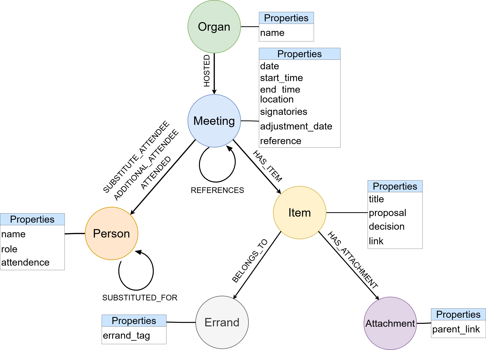

# Democracy Chatbot


Democracy Chatbot is a project that aims to extract structured data from unstructured meeting protocols and create a knowledge graph for efficient data retrieval and querying. The project utilizes a Large Language Model (LLM) to extract metadata from PDF files obtained by scraping the website of the city of nykerleby. The extracted data is then converted into a knowledge graph, enabling quick access to the information. Additionally, the project includes a chatbot app that allows users to interact with the extracted data. 

## Project Setup

To set up the project, follow the steps below:

1. Create a new conda environment by running the following command:

    ```bash
    conda create -n llm-data-extraction python=3.11
    
    conda activate llm-data-extraction
    ```

1. Clone the project repository by executing the following command:

    ```bash
    git clone git@github.com:NoviaIntSysGroup/llm-data-extraction.git
    ```

1. Navigate to the project directory and install the required packages by running the following command:

    ```bash
    pip install -e .
    ```

1. Register or Login in to [Neo4j Aura](https://console.neo4j.io/) and create a free neo4j instance. Save the login credentials as it will be given only once.

1. Create a secrets.env file in the config folder and add the following environment variables:
    ```bash
    OPENAI_API_KEY = "<api_key>"
    COHERE_API_KEY = "<api_key>"
    NEO4J_URI = "<uri>"
    NEO4J_USERNAME = "<username>"
    NEO4J_PASSWORD = "<password>"
    ```


## Running the Project

> To run the data extraction pipeline, perform the following steps:

1. Navigate to the project directory.
    ```bash
    cd llm-data-extraction
    ```

1. Open the `notebooks/unstructured_to_structured_data_pipeline.ipynb` file.

2. Execute the notebook

> To run the chatbot app, perform the following steps:

1. Navigate to the src directory.
    ```bash
    cd llm-data-extraction/src
    ```

2. Run the streamlit app:
    ```bash
    streamlit run app.py
    ```
3. Open the app in your browser with the url shown in the terminal.

**Note: Before running the chatbot app, ensure that there is an already populated knowledge graph in Neo4j. If there is no existing knowledge graph, please run the data extraction pipeline first.**

## Project Structure

The project directory contains the following files and folders:

- `notebooks/`: Contains the notebooks used in the project.
- `src/`: Contains the source code of the project.
- `data/`: Contains the data used in the project. PDFs and HTML files downloaded by the scripts are stored here.
- `data/example_prompts/`: Contains the prompts used for LLMs.
- `data/schema/`: Contains the schema for the JSON data.
- `assets/`: Contains the images used in the project.
- `config/`: Contains the configuration files used in the project.

---

## Project Progress

### Data Processing Workflow


This figure outlines the workflow for converting unstructured data from meeting protocols into structured data suitable for creating a knowledge graph. The idea is to use a Large Language Model (LLM) to extract the necessary information from the meeting protocols, and then convert the extracted data into a knowledge graph so that data can be retrieved and queried quickly and reliably.

> Note: The steps that works well right now is marked with ✅

#### Data Acquisition and Pre-processing

1. ✅ **Scrape Website**: The initial step involves scraping the [website of city of nykerleby](https://kungorelse.nykarleby.fi:8443/ktwebbin/dbisa.dll/ktwebscr/pk_kokl_tweb.htm) to gather the required data.
1. ✅ **Download PDFs**: After scraping, we have metadata and download links for the protocols which is then downloaded for further processing.
1. ✅ **Convert to HTML**: The PDFs are converted into HTML format (instead of plain text). The html preserves the layout information of the PDFs, which is useful for extracting the data.

#### Data Extraction with Large Language Model (LLM)

> The structure of the meetings are as follows:

        

1. ✅ **Extract Meeting Metadata with LLM**: Utilize a Large Language Model to extract metadata from the meetings documented in the HTML files. The JSON schema and prompt can be found in the [llm prompts folder](data/llm_prompts/meeting_metadata_extraction_prompt.txt).
1. ⭕ **Extract Agenda with LLM**: Further extract the agenda from the meeting data using the LLM. The JSON schema and prompt can be found in the [llm_prompts folder](data/llm_prompts/agenda_extraction_prompt.txt). One might need to make different prompts for each organ as the pdf structure for organs vary slightly.
2. ✅ **Convert to JSON**: The extracted data is then converted into JSON (hierarchical format) from DataFrame (flat format). DataFrames are useful for quick filtering and manipulation of the data whereas JSON format is useful for creating a knowledge graph.

#### Knowledge Graph (KG) Conversion

> KG Schema



1. ✅ **Cypher Script for JSON to KG**: Convert the JSON formatted data into a knowledge graph using a Cypher script.
2. ✅ **User Query to Cypher with LLM**: Convert the user query into cypher query using a LLM.
3. ✅ **Retrieved Relevant Data**: The result of the user query is the retrieval of relevant data from the knowledge graph.

This workflow transforms unstructured data into structured knowledge that is easily accessible and queryable by end-users.

#### Intelligent Document Chatbot

- ✅ **Relevant Data + Usery Query**: The relevant data and user query is then sent to the llm.
- ✅ **LLM Answer Based on Data**: The llm then generates an answer to the user query based on the relevant data.


## Future Improvements:

- [ ] Add unit tests to the data extraction pipeline
- [ ] Add post-processing logic to remove/fix inconsistencies in the knowledge graph